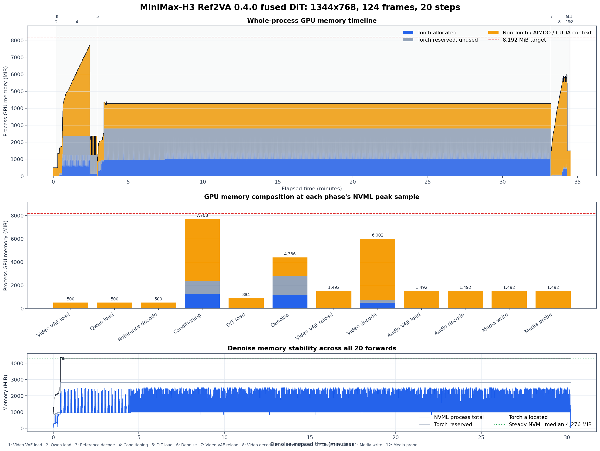

# MiniMax H3 SeqAttn for ComfyUI

Exact CPU-backed streaming attention for native ComfyUI MiniMax-H3 models.

[](#requirements)
[](#requirements)
[](#models)
[](#validated-run)

This package bounds both major MiniMax-H3 activation paths. The DiT and Qwen
SeqAttn patches keep long-sequence hidden state and complete Q/K/V tensors in
pinned CPU memory while attention, projections, residual updates, mergers, and
MLPs execute in bounded GPU tiles. Both stages use a strict current-layer plus
next-layer Dynamic VBAR weight pipeline instead of ComfyUI's native prefetch
queue. The independent video VAE patch streams spatial tiles and long inputs.
All three patches work with existing ComfyUI checkpoints without conversion.
MiniMax-H3 text projection and token refinement run once per sampling job; the
refined conditioning is then reused from pinned CPU memory for the remaining
denoise steps.

Supported layouts: T2VA, FL2VA, and Ref2VA. The published `0.4.0` validation is
a complete 20-step, 81,180-token Ref2VA run at 1344x768 with 124 output frames.
That historical result validates the fused DiT path and the previous Qwen
offload implementation; it is not a Qwen SeqAttn performance claim.

The supported ComfyUI baseline is fixed to **version `0.30.0`, commit
`9a9fdb10ed144ce760d9682cb247526ea23cc525`**. Newer ComfyUI releases are not
part of the `0.4.x` compatibility contract, even if individual code paths may
continue to work.

## Validated Run

The `0.4.0` fused DiT path completed a real **20-step MiniMax-H3 Ref2VA edit**
at 1344x768 with 124 reference frames and 124 output frames. It used DynamicVRAM
for model weights, a strict current-block plus next-block SeqAttn prefetch
pipeline, and an 8,192 MiB whole-process target.

### Generated Output

[](assets/benchmark/seqattn_ref2va_8g_20step_1344x768_124f.mp4)

Animated 8 fps preview. Click it to open the full-resolution 24 fps MP4.

### Reference Video

[](assets/benchmark/ref2va_reference_1344x768_124f.mp4)

Animated 8 fps preview. Click it to open the full-resolution 24 fps MP4. This
clip contains the exact first 124 reference frames used by the run.

| `0.4.0` community-package run | Result |
|---|---:|
| Status | **20/20 denoise steps completed** |
| Packed sequence | **81,180 tokens** |
| Whole-process GPU peak | **7,708 MiB NVML** |
| GPU headroom to 8,192 MiB target | **484 MiB** |
| Denoise GPU peak | **4,386 MiB NVML** |
| Denoise steady state | **4,274-4,276 MiB NVML** |
| Denoise time | **1,812.935 s / 30m 12.935s** |
| First forward with compile/warmup | **252.666 s** |
| Following 19 steady forwards | **81.033 s mean, 80.925-81.144 s range** |
| Complete pipeline | **2,073.534 s / 34m 33.534s** |
| CPU RSS peak | **32,666 MiB** |
| Output | **H.264 + AAC, 1344x768, 124 frames, 24 fps, 5.167 s** |



The plot separates Torch allocations, unused Torch reservation, and the
remaining process allocation reported by NVML. The last category includes
DynamicVRAM/AIMDO mappings, VBAR-resident weights, CUDA context memory, and
other non-Torch CUDA allocations; the available trace cannot split those
subsources further. See the
[full experiment record](docs/community_v040_ref2va_video_20step_20260825.md)
for per-phase values and raw artifacts.

<details>
<summary><strong>Prompt and validation details</strong></summary>

```text
Use <Video 1> as the exact reference for the original environment, existing subjects, object layout, camera trajectory, framing, perspective, lens behavior, lighting, colors, materials, timing, and scene continuity. Keep the video photorealistic and preserve all original people and objects in their original roles. Add one new, clearly visible adult woman without replacing or obscuring the original main subjects.

The added woman has shoulder-length dark hair and wears a vivid red jacket, a plain white shirt, black trousers, and dark shoes. Keep her face, hairstyle, clothing, body proportions, and identity fully consistent in every frame. Place her naturally within the scene at the correct scale, depth, and perspective, with physically plausible contact shadows, reflections, occlusion, and lighting that match the original footage.

At the beginning, she enters smoothly from the right edge of the frame and walks at a relaxed natural pace toward the center-right midground. During the middle of the shot, she slows down, stops beside the main area of interest, looks toward the principal object or activity already present in the scene, and clearly points toward it with her left hand. During the final part of the shot, she lowers her pointing hand, turns her head and upper body toward the camera, smiles naturally, and gives one clear friendly wave with her right hand. Her walking, stopping, pointing, turning, and waving must form one continuous believable action with stable anatomy and no sudden position changes.

Do not alter the visual style, weather, time of day, architecture, machinery, background, camera motion, or actions of the original subjects. Do not add any other new person. Do not create duplicate limbs, identity changes, flicker, teleportation, unintended cuts, text, subtitles, logos, or watermarks.
```

- Model: MiniMax-H3 Ref2VA INT8 ConvRot DiT
- Text encoder: Qwen3-VL 32B NVFP4 AWQ with the historical `prefetch` offload
- Qwen conditioning: 6,174 rows
- Qwen estimated activation: 2,358.12 MiB plus 128 MiB safety
- Query chunk: 5,760 tokens
- K/V tile: 4,096 tokens
- QKV projection tile: 4,096 tokens
- MLP tile: 4,096 tokens
- Seed: 0
- GPU/CPU memory sampling interval: 20 ms
- Weight scheduler: 20 forwards, 1,000 blocks, 5,000 lifecycle records
- Maximum staged blocks: 2
- VBAR-loaded peak: 320 MiB
- Measurements are from one run on August 25, 2026 UTC and have no error bars.
- The run used physical GPU 1 with CPU and memory bound to NUMA node 7. This is
  a single-node capacity/stability result, not the calibrated 56 GB/s
  interleaved host-memory performance result.

</details>

## Qwen Conditioning

Add **MiniMax H3 Qwen SeqAttn** after the MiniMax `CLIPLoader` and before the
MiniMax conditioning node. Connecting it explicitly selects the streaming Qwen
implementation; wiring the loader directly to the conditioning node keeps the
native ComfyUI implementation. The bundled low-memory workflows connect it.
The previous activation-estimate-based Qwen BF16 offload node has been removed.

The SeqAttn node keeps complete vision and decoder hidden states, Q/K/V, and
DeepStack features in pinned CPU memory. GPU execution is limited to configured
projection, attention, merger, output-projection, residual, and MLP tiles. It
uses packed non-causal vision attention and causal decoder GQA without building
a quadratic causal mask. DeepStack is injected directly into CPU hidden after
each of the first three decoder layers. Decoder token embedding stays on the CPU:
only unique token rows are gathered and dequantized from the mmap-backed INT8
table before they are written into the final pinned hidden tensor.

Qwen uses the same current-plus-next Dynamic VBAR weight pipeline as the DiT
path. Before a stage is prefetched to the GPU for the first time, its checkpoint
data is synchronously materialized into the ComfyUI loaded-weight host pin. This
keeps cold-start execution identical to later cached encodes instead of consuming
an incomplete first VBAR transfer. It does not impose an artificial presentation-
length limit; pinned host allocations, attention work, and runtime still scale
with the actual text,
image, and video input. Its node exposes the deployment-sensitive resident Q
chunk and transferred K/V chunk independently from the DiT node:

| Setting | Default | Description |
|---|---:|---|
| `q_chunk_tokens` | `5760` | Resident Q rows for Qwen vision and decoder attention |
| `kv_chunk_tokens` | `4096` | K/V rows transferred per attention tile |

QKV projection and MLP tile sizes come from the shared SeqAttn TOML:

```toml
[minimax_h3_qwen]
qkv_tile_tokens = 4096
mlp_tile_tokens = 4096
```

The shipped Qwen Q/KV and tile values currently reuse the measured RTX 5090
DiT configuration. They are starting values, not a claim that Qwen has been
independently tuned to its performance optimum.

## Install

### ComfyUI Manager

Search for **MiniMax H3 SeqAttn**, install it, and restart ComfyUI.

### Manual

```bash
cd /path/to/ComfyUI
git fetch origin 9a9fdb10ed144ce760d9682cb247526ea23cc525
git checkout --detach 9a9fdb10ed144ce760d9682cb247526ea23cc525

cd /path/to/ComfyUI/custom_nodes
git clone --branch community/comfyui-minimax-h3-seqattn \
  https://github.com/renlililoli/minimax-h3-seq-chunk-attn.git \
  ComfyUI-MiniMaxH3-SeqAttn
cd ComfyUI-MiniMaxH3-SeqAttn
python -m pip install -e .
```

No Git submodules are required. Installation resolves the pinned
`seqattn-core[dit]` runtime directly from its upstream alpha.3 release commit.

## Requirements

- ComfyUI `0.30.0`, commit
  `9a9fdb10ed144ce760d9682cb247526ea23cc525`
- Linux and NVIDIA CUDA
- Python `>= 3.10`
- Batch size 1
- Sufficient CPU DRAM for full hidden and Q/K/V storage

The attention and Qwen activation paths use BF16 regardless of checkpoint
storage precision. The Qwen node requires `CLIPLoader` device `default`. LoRA,
diffusion-model replacement patches, NVMe activation backing, and multi-GPU
execution are not currently supported.

The extension rejects other reported ComfyUI versions during entrypoint
loading with an explicit compatibility error. This avoids silently treating a
changed internal MiniMax-H3 sampling contract as a supported environment.

For an RTX 50-series container, use the pinned
[`docker/Dockerfile`](docker/Dockerfile) and
[`docker/README.md`](docker/README.md). The image starts from the exact
ComfyUI/PyTorch/CUDA base used by the checked-in examples, verifies the pinned
ComfyUI commit and DynamicVRAM runtime during the build, and installs this node
with its fixed `seqattn-core` revision.

### AIMDO Startup Order

Normal Web UI users do not need a separate AIMDO bootstrap. Start the pinned
ComfyUI checkout through its standard `main.py` entrypoint and leave
DynamicVRAM enabled. ComfyUI initializes `comfy_aimdo.control` before importing
PyTorch and the dynamic model patcher, so workflows queued after the UI starts
use the correct initialization order.

This guarantee does not apply to custom Python launchers that bypass
`main.py`. Such launchers must initialize `comfy_aimdo.control` before
importing `torch`, `nodes`, `comfy.model_patcher`, or any module that imports
`comfy_aimdo.host_buffer`. Otherwise `host_buffer` can cache an uninitialized
native-library handle and fail when `ModelPatcherDynamic` creates its first
host buffer. The bundled command-line examples perform this early
initialization automatically.

## Models

The bundled workflows use these files from
[Comfy-Org/MiniMax-H3](https://huggingface.co/Comfy-Org/MiniMax-H3):

```text
ComfyUI/models/
|-- diffusion_models/
|   |-- minimax_h3_fl2va_pruned_int8_convrot.safetensors
|   `-- minimax_h3_ref2va_pruned_int8_convrot.safetensors
|-- text_encoders/
|   `-- qwen3vl_32b_minimax_h3_nvfp4_awq.safetensors
`-- vae/
    |-- minimax_h3_video_vae_fp16.safetensors
    `-- minimax_h3_audio_vae_fp32.safetensors
```

Model weights are not included with this node.

## Usage

For command-line, two-step end-to-end checks after a fresh installation, see
the bundled [`examples/`](examples/README.md) directory. It includes one-click
T2VA, FL2VA, image-reference Ref2VA, and video-reference Ref2VA scripts plus
recorded outputs, memory traces, and validation metadata. Its summary separates
the current clean-install `0.4.1` results for all four supported scenarios.

Import the workflow matching the generation mode:

| Mode | Workflow | Inputs |
|---|---|---|
| T2VA | [`minimax_h3_seqattn_t2va.json`](workflows/minimax_h3_seqattn_t2va.json) | Prompt |
| First-frame video | [`minimax_h3_seqattn_first_frame.json`](workflows/minimax_h3_seqattn_first_frame.json) | Prompt + first frame |
| Last-frame video | [`minimax_h3_seqattn_last_frame.json`](workflows/minimax_h3_seqattn_last_frame.json) | Prompt + last frame |
| FL2VA | [`minimax_h3_seqattn_fl2va.json`](workflows/minimax_h3_seqattn_fl2va.json) | Prompt + first and last frames |
| Ref2VA | [`minimax_h3_seqattn_ref2va.json`](workflows/minimax_h3_seqattn_ref2va.json) | Prompt + image/video/audio references |
| Ref2VA long 2-step validation | [`minimax_h3_seqattn_ref2va_long_2step.json`](workflows/minimax_h3_seqattn_ref2va_long_2step.json) | Bundled 243-frame reference video + audio |

The four T2VA/FL2VA workflows use the same FL2VA checkpoint. The first frame
anchors frame 0; the last frame anchors the final aligned output frame. To
patch an existing workflow, add **MiniMax H3 SeqAttn** immediately after the
diffusion-model loader and **MiniMax H3 Qwen SeqAttn** immediately after the
MiniMax `CLIPLoader`. For bounded keyframe encoding and video decoding, pass
the video VAE through **MiniMax H3 VAE Streaming**. Each patch is independent:
connect it to select streaming for that stage, or wire around it to keep the
native ComfyUI implementation. There is no node-level `enabled` switch and no
silent native fallback after a streaming error.

The bundled Ref2VA workflow uses **MiniMax H3 Reference to Video (SeqAttn)**.
It preserves the native reference ordering and payload, but completes Qwen
layout validation and text/visual encoding before any reference image, video,
or audio VAE encode. It does not select a backend itself; the supplied `CLIP`
and video `VAE` objects determine which implementations run.

The workflow files for all modes use the fused DiT integration introduced in
`0.4.0`. The current release-level performance and memory claim remains the
20-step Ref2VA run documented above; the `0.4.1` two-step example results are
clean-install functional checks and are not presented as throughput results.

The long Ref2VA workflow is a UI-driven memory and integration stress test,
not a recommended quality preset. It generates 243 frames at 1344x768 from the
bundled 243-frame reference and intentionally uses only two denoise steps.
Before importing it, copy
`assets/benchmark/ref2va_reference_1344x768_243f.mp4` into the ComfyUI
`input/` directory. See [`examples/README.md`](examples/README.md) for the exact
commands and NUMA memory guidance for this host-memory-heavy case.

Calibrate `q_chunk_tokens` for each deployed stage, GPU, backend, CPU affinity, and
NUMA memory policy using the independent
[SeqAttn chunk-size calibration guide](https://github.com/renlililoli/stream-attn/blob/main/docs/q_chunk_calibration.md).
The shipped `5760` value matches the validated RTX 5090 single-node path at
about 37 GB/s concurrent pinned H2D bandwidth. The same GPU used `3840` after
interleaving pinned pages across two populated memory nodes reproduced about
56.7 GB/s. Do not select Q from nominal PCIe bandwidth or advertised GPU peak
TFLOPS; the guide measures the effective concurrent bandwidth and resident
attention throughput used by the roofline.

The DiT and Qwen patch nodes each expose their own Q/KV chunks as workflow
inputs. This makes backend selection and the main performance parameter
explicit per stage. QKV projection and MLP tiles, plus video VAE settings, are
deployment configuration. Set them in the shared SeqAttn TOML file selected by
`SEQATTN_CONFIG`, or
`~/.config/seqattn/config.toml`. An explicitly selected missing or invalid file
is an error; if the default user file is absent, the compiled defaults below
are used.

```toml
[attention]
backend = "auto"

[minimax_h3]
qkv_tile_tokens = 4096
mlp_tile_tokens = 4096

[minimax_h3_qwen]
qkv_tile_tokens = 4096
mlp_tile_tokens = 4096

[minimax_h3_vae]
tile_size = 192
workspace_mib = 512
```

The patch nodes do not impose a whole-process VRAM limit, silently shrink the
resident query chunk, or fall back to native execution.

## License

The custom node is GPL-3.0. Its external `seqattn-core` dependency is
Apache-2.0. See [`LICENSE`](LICENSE) and
[`THIRD_PARTY_NOTICES.md`](THIRD_PARTY_NOTICES.md).

The independent SeqAttn runtime is installed through the pinned
`seqattn-core[dit]` dependency; this community branch contains only the ComfyUI
integration and workflows.
