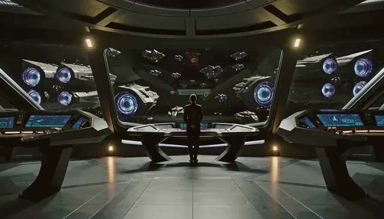
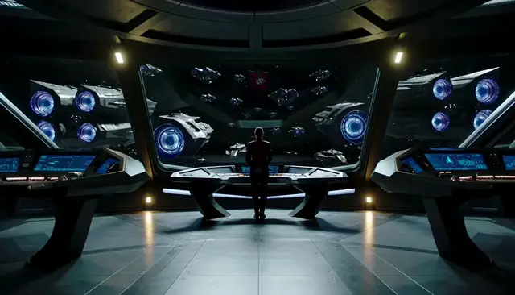
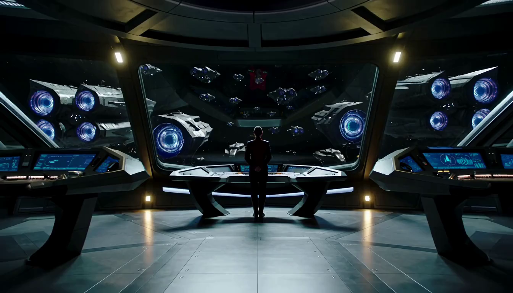
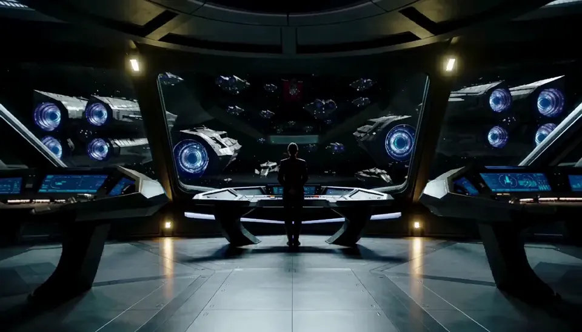
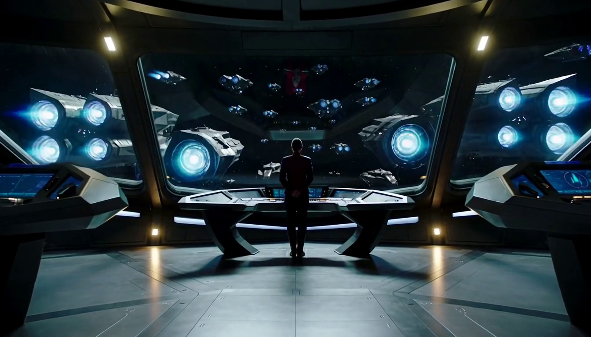

# MiniMax H3 SeqAttn for ComfyUI

Exact CPU-backed streaming attention for native ComfyUI MiniMax-H3 models.

[](#requirements)
[](#requirements)
[](#models)
[](#usage)

This package bounds both major MiniMax-H3 activation paths. The SeqAttn model
patch keeps long-sequence hidden states and complete Q/K/V tensors in pinned
CPU memory. The Qwen BF16 patch runs text and visual conditioning with bounded
BF16 activations and layer-offloaded weights. Both work with existing ComfyUI
checkpoints without conversion. MiniMax-H3 text projection and token refinement
run once per sampling job; the refined conditioning is then reused from pinned
CPU memory for the remaining denoise steps.

Supported layouts: T2VA, FL2VA, and Ref2VA. A 157,526-token, 243-frame,
1344x768 Ref2VA denoise step has been validated below an 8 GiB process target.

## 8 GiB Ref2VA Demo

The standalone community package completed a real **20-step MiniMax-H3
Ref2VA generation** at 1344x768 with 243 reference frames and 243 output
frames, restyling the source as a hand-painted pink fairy-tale world. The
combined text, reference-video, audio, and target-video layout is 157,526
tokens. Whole-process GPU memory peaked at **7,696 MiB** on an RTX 5090.

### Generated Output

[](assets/benchmark/seqattn_ref2va_8g_20step_1344x768_243f.mp4)

Animated 8 fps preview. Click it to open the full-resolution 24 fps MP4.

### Reference Video

[](assets/benchmark/ref2va_reference_1344x768_243f.mp4)

Animated 8 fps preview. Click it to open the full-resolution 24 fps MP4 with
the original AAC audio track.

| Community-package run | Result |
|---|---:|
| Status | **20/20 denoise steps completed** |
| Whole-process GPU peak | **7,696 MiB NVML** |
| GPU headroom to 8,192 MiB target | **496 MiB** |
| Denoise time | **5,757.480 s / 95m 57.480s** |
| Mean denoise time | **287.874 s / 4m 47.874s per step** |
| Complete pipeline | **5,998.311 s / 99m 58.311s** |
| CPU RSS peak | **61.06 GiB** |
| Output | **H.264, 1344x768, 243 frames, 24 fps, 10.125 s** |

A comparable historical 157K-token native ComfyUI run OOMed in its first QKV
projection on a 32 GB RTX 5090 after a 31,590 MiB sampled process peak. SeqAttn
trades CPU DRAM and runtime for the ability to complete the long-video workload
with a bounded GPU working set; this is a capacity result, not a
native-attention speedup claim.

<details>
<summary><strong>Prompt and validation details</strong></summary>

```text
Transform <Video 1> into one continuous, richly detailed hand-painted Japanese animation set in a luminous pink fairy-tale world. Preserve only the reference video's temporal structure: the exact human actions, body movement, gesture timing, camera trajectory, framing, perspective, scene transitions, and broad spatial arrangement. Do not preserve the original photographic rendering, colors, materials, technological identity, or industrial appearance.

Redesign every visible person, object, surface, structure, and background as polished 2D animation with clean expressive line art, soft cel shading, delicate painted textures, and stable character design across every frame. Use a cohesive palette of pastel pink, rose, blush, lavender, pearl white, and small accents of warm gold. Fill the environment with peonies, translucent crystal flowers, flowing silk ribbons, soft clouds, sparkling dust, floating petals, gentle magical haze, and warm diffused light.

Replace every machine, screen, electronic device, vehicle, metal mechanism, laboratory element, industrial structure, futuristic prop, and technological detail with an organic fairy-tale counterpart located in the same approximate position and following the same broad motion. Suitable replacements include flowers, carved pearl, crystal, fabric, clouds, vines, luminous water, or elegant storybook architecture. The replacements should preserve scene readability and motion continuity without retaining the original object's technological appearance.

Every frame must be unmistakably animated, romantic, soft, magical, organic, and predominantly pink. Maintain coherent faces, clothing, proportions, object shapes, lighting direction, and background details throughout the entire shot. Use smooth natural motion and stable geometry with no flicker, no sudden redesigns, and no unintended scene cuts. Do not include photorealism, live-action textures, technology, machinery, screens, electronics, metal, industrial imagery, science fiction, cyberpunk, text, subtitles, watermarks, or logos.
```

- Model: MiniMax-H3 Ref2VA INT8 ConvRot DiT
- Text encoder: Qwen3-VL 32B NVFP4 AWQ with community `prefetch` offload
- Qwen conditioning: 11,564 rows
- SeqAttn workspace: 1,024 MiB
- K/V tile: 4,096 tokens
- Seed: 0
- GPU/CPU memory sampling interval: 20 ms
- Community package: commit `03318ee`, read-only mounted worktree
- Complete memory trace: 89,251 process samples
- The generated benchmark MP4 contains video only; the reference MP4 also has
  an AAC audio stream.
- Measurements are from one run on August 21, 2026 UTC and have no error bars.

</details>

## 5-Second Ref2VA Directed Edit

The same community package also completed a **20-step, 5-second MiniMax-H3
Ref2VA edit** at 1344x768 with 124 reference frames and 124 output frames. This
prompt tests directed scene editing rather than full restyling: preserve the
reference shot while adding one new person who walks in, points, and waves. The
combined layout is 81,467 tokens, and whole-process GPU memory again peaked at
**7,696 MiB** on an RTX 5090.

### Generated Output

[](assets/benchmark/seqattn_ref2va_8g_20step_1344x768_124f.mp4)

Animated 8 fps preview. Click it to open the full-resolution 24 fps MP4.

### Reference Video

[](assets/benchmark/ref2va_reference_1344x768_124f.mp4)

Animated 8 fps preview. Click it to open the full-resolution 24 fps MP4. This
clip contains the exact first 124 reference frames used by the run.

| Community-package run | Result |
|---|---:|
| Status | **20/20 denoise steps completed** |
| Whole-process GPU peak | **7,696 MiB NVML** |
| GPU headroom to 8,192 MiB target | **496 MiB** |
| Denoise time | **2,310.824 s / 38m 30.824s** |
| Mean denoise time | **115.541 s / 1m 55.541s per step** |
| Complete pipeline | **2,416.826 s / 40m 16.826s** |
| CPU RSS peak | **52.32 GiB** |
| Output | **H.264, 1344x768, 124 frames, 24 fps, 5.167 s** |

<details>
<summary><strong>Prompt and validation details</strong></summary>

```text
Use <Video 1> as the exact reference for the original environment, existing subjects, object layout, camera trajectory, framing, perspective, lens behavior, lighting, colors, materials, timing, and scene continuity. Keep the video photorealistic and preserve all original people and objects in their original roles. Add one new, clearly visible adult woman without replacing or obscuring the original main subjects.

The added woman has shoulder-length dark hair and wears a vivid red jacket, a plain white shirt, black trousers, and dark shoes. Keep her face, hairstyle, clothing, body proportions, and identity fully consistent in every frame. Place her naturally within the scene at the correct scale, depth, and perspective, with physically plausible contact shadows, reflections, occlusion, and lighting that match the original footage.

At the beginning, she enters smoothly from the right edge of the frame and walks at a relaxed natural pace toward the center-right midground. During the middle of the shot, she slows down, stops beside the main area of interest, looks toward the principal object or activity already present in the scene, and clearly points toward it with her left hand. During the final part of the shot, she lowers her pointing hand, turns her head and upper body toward the camera, smiles naturally, and gives one clear friendly wave with her right hand. Her walking, stopping, pointing, turning, and waving must form one continuous believable action with stable anatomy and no sudden position changes.

Do not alter the visual style, weather, time of day, architecture, machinery, background, camera motion, or actions of the original subjects. Do not add any other new person. Do not create duplicate limbs, identity changes, flicker, teleportation, unintended cuts, text, subtitles, logos, or watermarks.
```

- Model: MiniMax-H3 Ref2VA INT8 ConvRot DiT
- Text encoder: Qwen3-VL 32B NVFP4 AWQ with community `prefetch` offload
- Qwen conditioning: 6,461 rows
- SeqAttn workspace: 1,024 MiB
- K/V tile: 4,096 tokens
- Seed: 0
- GPU/CPU memory sampling interval: 20 ms
- Community package: commit `03318ee`, clean read-only mounted worktree
- Complete memory trace: 36,239 process samples
- Both benchmark MP4 files contain video only.
- Measurements are from one run on August 21, 2026 UTC and have no error bars.

</details>

## 8 GiB FL2VA Demo

The bundled [FL2VA workflow](workflows/minimax_h3_seqattn_fl2va.json) completed
a real **20-step first-and-last-frame generation** at 1344x768. Both keyframes
are encoded with the streaming VAE, and the model generates the 56-frame
transition between them. Whole-process GPU memory peaked at **7,272 MiB** on an
RTX 5090.

| First frame | Generated transition | Last frame |
|---|---|---|
|  | [](assets/benchmark/seqattn_fl2va_8g_20step_1344x768_56f.mp4) |  |

The center image is an animated 8 fps preview. Click it to open the
full-resolution 24 fps MP4.

| Community-package run | Result |
|---|---:|
| Status | **20/20 denoise steps completed** |
| Whole-process GPU peak | **7,272 MiB NVML** |
| GPU headroom to 8,192 MiB target | **920 MiB** |
| Denoise time | **400.612 s / 6m 40.612s** |
| Mean denoise time | **20.031 s per step** |
| Text conditioning | **10.707 s** |
| Output VAE decode | **8.847 s** |
| CPU RSS peak | **46.36 GiB** |
| Output | **H.264, 1344x768, 56 frames, 24 fps, 2.333 s** |

To reproduce this layout, import the
[`minimax_h3_seqattn_fl2va.json`](workflows/minimax_h3_seqattn_fl2va.json)
workflow and select a first-frame image and a last-frame image in its two
**Load Image** nodes. The workflow already uses the validated 8 GiB defaults;
replace the images and prompt, then queue the graph normally.

<details>
<summary><strong>Prompt and generation settings</strong></summary>

```text
Create a smooth, coherent cinematic transition from the supplied first frame to the supplied last frame. Preserve subject identity, scene geometry, lighting, and camera continuity while producing natural motion through one continuous shot. No cuts, text, subtitles, or logos.
```

- Model: MiniMax-H3 FL2VA INT8 ConvRot DiT
- Text encoder: Qwen3-VL 32B NVFP4 AWQ with community `prefetch` offload
- Resolution and length: 1344x768, 56 frames, 24 fps
- Qwen conditioning: 2,081 rows
- Packed sequence: 21,419 tokens
- SeqAttn workspace: 1,024 MiB
- K/V tile: 4,096 tokens
- VAE tile: 192 pixels
- VAE workspace: 512 MiB
- Seed: 0
- Measurements are from one run on August 21, 2026 UTC and have no error bars.

</details>

## Qwen Conditioning

Add **MiniMax H3 Qwen BF16 Offload** after the MiniMax `CLIPLoader` and before
the MiniMax conditioning node. The bundled workflow already includes it.

The node converts token, vision, and decoder activations to BF16, uses an
in-place decoder MLP, reuses hidden-state storage between layers, and rejects
oversized text/image/video presentations before the vision tower runs.

| Setting | Default | Description |
|---|---:|---|
| `offload_mode` | `prefetch` | `prefetch` uses two asynchronous weight streams; `extreme` disables asynchronous prefetch for the lowest transient weight footprint |
| `activation_limit_mib` | `5888` | Per-layer Qwen activation-plan limit |
| `max_conditioning_rows` | `25000` | Hard limit for the complete Qwen presentation |
| `preflight_safety_mib` | `128` | Reserve added to the calibrated preflight estimate |

The 20-step demo conditioned 11,564 Qwen rows. On an RTX 5090, the default
`prefetch` policy completed all 50 decoder layers in 32.93 seconds at a 5,282
MiB text-window process peak. A 21.4K-row multi-reference probe completed in
19.60 seconds at 7,724 MiB under the same 8 GiB target. Preflight accounts for
the quadratic causal mask and retained DeepStack features; the 25K-row value is
an absolute input cap, not a guarantee that every 25K-row composition fits in
8 GiB.

## Install

### ComfyUI Manager

Search for **MiniMax H3 SeqAttn**, install it, and restart ComfyUI.

### Manual

```bash
cd /path/to/ComfyUI/custom_nodes
git clone --branch community/comfyui-minimax-h3-seqattn \
  https://github.com/renlililoli/minimax-h3-seq-chunk-attn.git \
  ComfyUI-MiniMaxH3-SeqAttn
```

No submodules or additional Python packages are required.

## Requirements

- ComfyUI `>= 0.30.0`
- Linux and NVIDIA CUDA
- Python `>= 3.10`
- Batch size 1
- Sufficient CPU DRAM for full hidden and Q/K/V storage

The attention and Qwen activation paths use BF16 regardless of checkpoint
storage precision. The Qwen node requires `CLIPLoader` device `default`. LoRA,
diffusion-model replacement patches, NVMe activation backing, and multi-GPU
execution are not currently supported.

## Models

The bundled workflows use these files from
[Comfy-Org/MiniMax-H3](https://huggingface.co/Comfy-Org/MiniMax-H3):

```text
ComfyUI/models/
|-- diffusion_models/
|   |-- minimax_h3_fl2va_pruned_int8_convrot.safetensors
|   `-- minimax_h3_ref2va_pruned_int8_convrot.safetensors
|-- text_encoders/
|   `-- qwen3vl_32b_minimax_h3_nvfp4_awq.safetensors
`-- vae/
    |-- minimax_h3_video_vae_fp16.safetensors
    `-- minimax_h3_audio_vae_fp32.safetensors
```

Model weights are not included with this node.

## Usage

For command-line, two-step end-to-end checks after a fresh installation, see
the bundled [`examples/`](examples/README.md) directory. It includes one-click
T2VA, FL2VA, image-reference Ref2VA, and video-reference Ref2VA scripts plus
the recorded outputs, memory traces, and validation metadata.

Import the workflow matching the generation mode:

| Mode | Workflow | Inputs |
|---|---|---|
| T2VA | [`minimax_h3_seqattn_t2va.json`](workflows/minimax_h3_seqattn_t2va.json) | Prompt |
| First-frame video | [`minimax_h3_seqattn_first_frame.json`](workflows/minimax_h3_seqattn_first_frame.json) | Prompt + first frame |
| Last-frame video | [`minimax_h3_seqattn_last_frame.json`](workflows/minimax_h3_seqattn_last_frame.json) | Prompt + last frame |
| FL2VA | [`minimax_h3_seqattn_fl2va.json`](workflows/minimax_h3_seqattn_fl2va.json) | Prompt + first and last frames |
| Ref2VA | [`minimax_h3_seqattn_ref2va.json`](workflows/minimax_h3_seqattn_ref2va.json) | Prompt + image/video/audio references |

The four T2VA/FL2VA workflows use the same FL2VA checkpoint. The first frame
anchors frame 0; the last frame anchors the final aligned output frame. To
patch an existing workflow, add **MiniMax H3 SeqAttn** immediately after the
diffusion-model loader and **MiniMax H3 Qwen BF16 Offload** immediately after
the MiniMax `CLIPLoader`. For bounded keyframe encoding and video decoding,
pass the video VAE through **MiniMax H3 VAE Streaming**; the bundled workflows
use a validated 192-pixel tile and 512 MiB activation workspace. This also
streams long VAE inputs and decoded frames through CPU memory.

The bundled Ref2VA workflow uses **MiniMax H3 Reference to Video (SeqAttn)**.
It preserves the native reference ordering and payload, but completes Qwen
preflight and text/visual encoding before any reference image, video, or audio
VAE encode. Oversized multimodal prompts therefore fail before expensive VAE
work begins.

All four FL2VA checkpoint modes were validated at 1344x768 with 56 output
frames under an 8 GiB process target on an RTX 5090:

| Mode | Validation | Packed tokens | GPU peak | Denoise |
|---|---:|---:|---:|---:|
| T2VA | 20/20 steps | 17,460 | 7,430 MiB | 322.038 s |
| First frame | 1/1 step | 19,390 | 7,332 MiB | 50.240 s |
| Last frame | 1/1 step | 19,388 | 7,332 MiB | 40.758 s |
| First + last frames | 20/20 steps | 21,419 | 7,272 MiB | 400.612 s |

The complete FL2VA run averaged 20.031 seconds per denoise step. Measurements
are from single runs on August 21, 2026 UTC and have no error bars.

| Setting | Default | Description |
|---|---:|---|
| `activation_workspace_mib` | `1024` | GPU workspace owned by SeqAttn |
| `kv_chunk_tokens` | `4096` | K/V tokens transferred per tile |
| `planner_mode` | `fit` | Fits resident query tiles to the workspace |
| `enabled` | `true` | Enables or bypasses the patch |

The workspace value is not a whole-process VRAM limit. Lower it if other
ComfyUI nodes or models leave less GPU headroom.

## License

The custom node is GPL-3.0. The bundled SeqAttn runtime is Apache-2.0. See
[`LICENSE`](LICENSE), [`LICENSES/Apache-2.0.txt`](LICENSES/Apache-2.0.txt), and
[`THIRD_PARTY_NOTICES.md`](THIRD_PARTY_NOTICES.md).

See the
[original development branch](https://github.com/renlililoli/minimax-h3-seq-chunk-attn/tree/feature/comfyui-minimax-h3-seqattn)
for project history.
