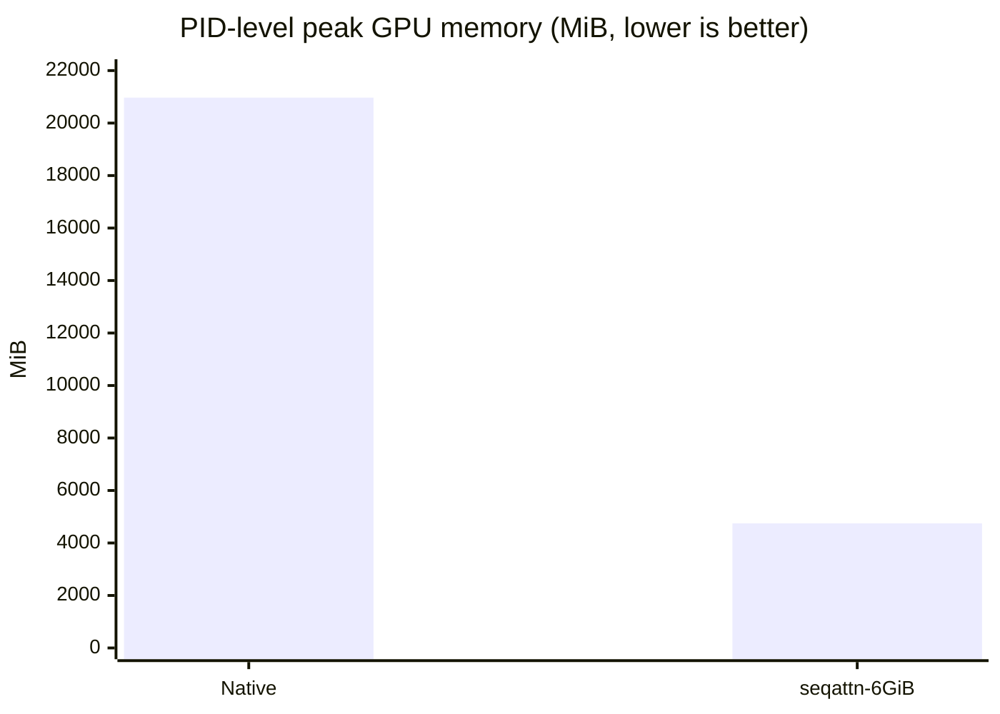
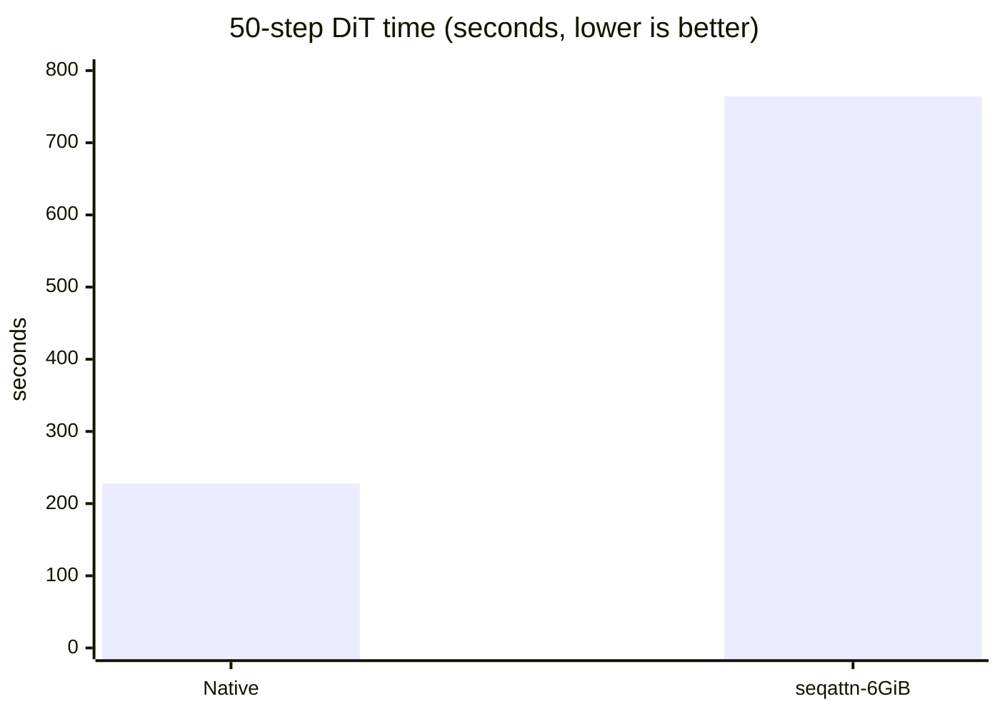

# MiniMax-H3 15K：Native vs. `seqattn` 完整视频生成

> 实验日期：2026-08-18 UTC  
> 结论：在同一张 RTX 5090 上，`seqattn` 以约 **3.35× DiT 延迟**为代价，将完整生成的 PID 级 GPU 峰值从 **20,970MiB** 降至 **4,748MiB**，即减少 **77.36% / 4.42×**，并在严格 6GiB 整进程预算下完成 50-step、双 VAE decode 和 MP4 mux。

## 🎬 实际生成结果

两个文件都经过 PyAV 校验：H.264、832×480、124 帧、5.1667 秒，附带 AAC 双声道 32kHz 音频。

| 路径 | 视频 | 文件大小 |
|---|---|---:|
| Native DiffSynth | [▶ 查看 / 下载 native MP4](media/minimax_h3_15k_native.mp4) | 9,038,072 bytes |
| `seqattn` · strict 6GiB | [▶ 查看 / 下载 seqattn MP4](media/minimax_h3_15k_seqattn_6gb.mp4) | 9,009,041 bytes |

<table>
  <tr>
    <th>Native DiffSynth</th>
    <th><code>seqattn</code> · 6GiB budget</th>
  </tr>
  <tr>
    <td><video controls width="410" src="media/minimax_h3_15k_native.mp4"></video></td>
    <td><video controls width="410" src="media/minimax_h3_15k_seqattn_6gb.mp4"></video></td>
  </tr>
</table>

GitHub 页面不保证内嵌 `<video>` 在所有客户端播放，因此上方同时保留了普通文件链接。

## 📊 核心结果

| 指标 | Native DiffSynth | `seqattn` · strict 6GiB | 对比 |
|---|---:|---:|---:|
| 状态 | success | success | 两者均完整生成 |
| PID NVML GPU 峰值 | 20,970MiB | **4,748MiB** | **减少 77.36% / 4.42×** |
| Torch allocated 峰值 | 18,662.9MiB | **3,771.6MiB** | **减少 79.79% / 4.95×** |
| Torch reserved 峰值 | 20,348MiB | **4,058MiB** | **减少 80.06% / 5.01×** |
| CPU RSS 峰值 | 35,164.3MiB | 38,697.1MiB | `seqattn` 多 3,532.8MiB |
| 50-step DiT 总耗时 | **227.833s** | 764.313s | `seqattn` 慢 3.35× |
| DiT step 中位数 | **4.428s** | 14.637s | `seqattn` 慢 3.31× |
| 完整 pipeline | **305.038s** | 798.938s | `seqattn` 慢 2.62× |
| Video VAE decode | 15.543s | **11.836s** | 不属于 attention 优化结论 |
| Audio VAE decode | 1.483s | **0.286s** | 不属于 attention 优化结论 |





这里的优势是容量，而不是吞吐：当 full-sequence activation 能放进 HBM 时，native FlashAttention 路径明显更快；`seqattn` 的价值是把这次任务从约 21GiB 的 GPU 工作集压到不足 4.75GiB，使其能在 6GiB 级整进程预算内真正完成。

## 🧪 公平性与运行协议

两次运行采用相同条件：

| 条件 | 值 |
|---|---|
| GPU | 同一张物理 RTX 5090，32,607MiB；两次测试顺序执行，不并发 |
| 模型 | MiniMax-H3 FL2VA NF4 |
| 计算精度 | BF16 |
| 权重 backing store | CPU DRAM；不使用 disk offload |
| 尺寸 | 480×832，124 frames，约 15,104 packed tokens |
| 推理 | 50 DiT blocks，50 denoise steps |
| prompt / seed | 相同 prompt，seed 0 |
| 显存采样 | 当前 PID 的 NVML，每 2ms 采样 |
| 输出 | Video VAE + Audio VAE + H.264/AAC mux |

显存策略不同且正是实验变量：

- Native 不设置人工 allocator cap；DiffSynth layer residency limit 为 29.358GiB。
- `seqattn` 设置 6,144MiB 整进程目标；CUDA context 估计 500MiB，安全余量 128MiB，因此 PyTorch allocator limit 为 5,516MiB；DiffSynth layer residency limit 为 3GiB。
- `seqattn` 的实测 4,748MiB 峰值低于 6,144MiB 目标 1,396MiB。
- 两次运行使用相同 CPU affinity。`seqattn` run 使用 NUMA memory binding；为避免该节点在 VAE decode 时触发 host-side OOM kill，最终 native success run 仅保留 CPU binding、未固定 memory policy。该差异可能影响 CPU 端延迟，不影响 PID NVML GPU 峰值的主要容量结论。

本报告是单次正式运行的 system characterization，不提供误差条、置信区间或统计显著性结论。

## 🧠 Native 与 `seqattn` 分别把什么放在哪里

两种路径都使用 CPU/DRAM 权重 offload。Native 的 20.97GiB 峰值并不意味着 encoder、DiT 和两个 decoder 同时全部驻留 GPU；峰值发生在 denoise，主要差异来自序列 activation 的放置方式。

| Denoise 期间 | Native DiffSynth | `seqattn` |
|---|---|---|
| 非活跃模型权重 | CPU DRAM | CPU DRAM |
| 当前 DiT 权重 | 由 DiffSynth 按层准备/驻留 GPU | 更严格的层驻留预算，backing 在 CPU DRAM |
| full hidden / residual | GPU | CPU-backed、按 projection/MLP chunk 搬运 |
| 完整 Q/K/V | GPU | CPU pinned backing；GPU 仅保留 resident Q 与 K/V tile |
| attention softmax 状态 | FlashAttention tile 内部 | GPU 中稳定 online-softmax `(m, l, O)` 状态 |
| attention output | full sequence GPU tensor | 直接交给 chunked out projection，避免 raw full output round-trip |
| MLP intermediate | full-sequence GPU activation | CPU-backed two-pass chunked intermediate |
| GPU 角色 | 足够容纳完整序列 activation | 固定大小 working-set/cache |

本次 `seqattn` 运行记录的逻辑传输总量为约 4.87TiB H2D、3.16TiB D2H（50 steps × 50 blocks 的累计软件计数），CPU activation/pinned peak 约 917.4MiB。这解释了其延迟代价：容量压力被转移到 CPU DRAM 和 PCIe，而不是被消除。

## 💾 Latent 持久化与可恢复性

benchmark 现在在调用 decoder **之前**分别原子保存 latent：

```text
..._video_predecode_latents.pt  (1, 24, 37, 30, 52), BF16
..._audio_predecode_latents.pt  (2, 32, 207), BF16
..._latents.pt                  {video, audio}
```

写入采用 `temporary file -> os.replace()`，成功后日志会明确打印：

```text
BENCH_LATENT_SAVED video ..._video_predecode_latents.pt
BENCH_LATENT_SAVED audio ..._audio_predecode_latents.pt
```

因此 VAE decode 或 mux 失败时无需重跑昂贵的 50-step denoise。仓库同时提供 `workspace/benchmarks/decode_saved_latents.py`，可从 combined latent 或单独 video latent 重新生成媒体。

## 📁 原始数据

Native success run：

```text
workspace/benchmarks/results/
native_480x832_f124_s50_gpu1_retry3_480x832_f124_s50_20260818T082113Z.json
native_480x832_f124_s50_gpu1_retry3_480x832_f124_s50_20260818T082113Z_memory_trace.csv.gz
```

`seqattn` strict-6GiB success run：

```text
workspace/benchmarks/results/
short6g_seqattn_480x832_f124_s50_gpu1_480x832_f124_s50_20260818T070725Z.json
short6g_seqattn_480x832_f124_s50_gpu1_480x832_f124_s50_20260818T070725Z_memory_trace.csv.gz
```

OOM、instrumentation failure 和 retry 历史均保留在 results 目录；本表只使用最终完整 success 点作为主对比。

## 结论边界

这组数据支持以下表述：

> 对于 15,104-token 的真实 MiniMax-H3 50-step 双模态生成，`seqattn` 在严格 6GiB 整进程预算下完成了 native 相同尺寸的完整工作流，PID GPU 峰值从 20,970MiB 降至 4,748MiB；代价是 50-step DiT 延迟增加至 3.35×，并增加 CPU RAM 与 PCIe 流量。

它不支持“`seqattn` 比 native 更快”，也不支持“所有尺寸下固定使用 4,748MiB”。更长序列的容量结论必须使用相应序列长度的实测结果。
