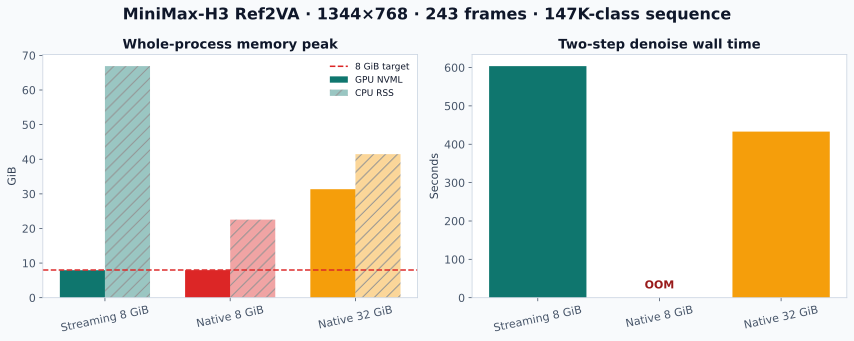
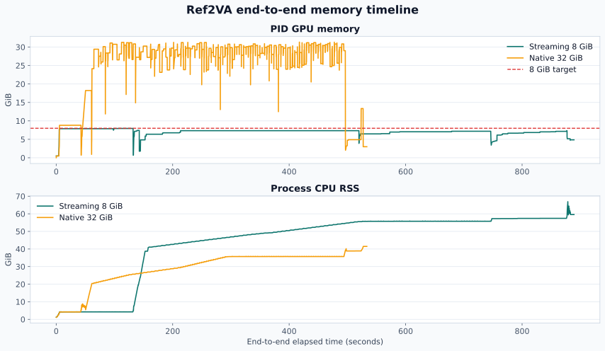

# MiniMax-H3 Ref2VA 768p activation-capacity experiment

Date: August 19, 2026

## Result

A real 10.125-second MiniMax-H3 Ref2VA task with synchronized video and audio
produces a 158,208-token packed sequence. On the same physical RTX 5090:

- native DiffSynth fails before completing the first denoise step under an
  8,192 MiB whole-process target;
- activation streaming completes both denoise steps, both VAE decoders, and
  MP4 mux under the same target, peaking at 8,138 MiB PID-level NVML memory;
- unrestricted native DiffSynth completes the same workflow but peaks at
  32,092 MiB.

The 8 GiB result is a logical whole-process budget enforced on a 32 GiB RTX
5090. It is not a physical 8 GiB board measurement. The 54 MiB observed margin
is narrow enough that a different driver, CUDA context, or allocator state may
require a slightly smaller activation workspace.

<p align="center">
  
</p>

## Task

The reference is an existing continuous video with its own soundtrack:

```text
source:      /models/minimax/assets/h3_direct_768p.mp4
resolution:  1344 x 768
frame rate:  24 fps
frames:      243
duration:    10.125 seconds
audio:       AAC stereo, 32 kHz
reference:   video_audio
output:      1344 x 768, 243 frames, synchronized audio
seed:        0
```

The edit asks MiniMax-H3 to preserve the subjects, actions, framing, camera
motion, temporal structure, and synchronized soundtrack while applying a
polished cinematic remaster. It does not loop frames, duplicate the last frame,
or concatenate unrelated clips.

H3 requires dimensions divisible by 32. A nominal 1280x720 request becomes
1280x736, while the default Ref2VA reference path targets the model's 768p
canvas. Using 1344x768 for both input and output avoids hidden resizing
asymmetry and follows the model's native 768p configuration.

The experiment uses two denoise steps to measure capacity and execution cost.
The generated MP4 proves that the complete workflow runs, but two steps are not
presented as a visual-quality result.

## Exact sequence

The token counts come from the real Ref2VA processor, reference VAE encoders,
and `MiniMaxH3Unit_PackedSequenceBuilder`, not from a synthetic hidden tensor.

| Packed component | Tokens |
|---|---:|
| Multimodal text/reference presentation | 11,401 |
| Reference video | 72,576 |
| Reference audio | 810 |
| Target video | 72,576 |
| Target audio | 810 |
| Used | 158,173 |
| Alignment padding | 35 |
| **Packed sequence** | **158,208** |

Latent shapes:

```text
reference video: T=72, H=48, W=84 -> 72,576 rows
reference audio: T=405, channels=2 -> 810 rows
target video:    [1, 24, 72, 48, 84]
target audio:    [2, 32, 405]
```

At this length, representative BF16 full-sequence tensors are already larger
than an 8 GiB working set:

| Tensor | Approximate size |
|---|---:|
| One `[tokens, 5376]` hidden | 1.58 GiB |
| Full Q/K/V | 6.34 GiB |
| MLP `fc1` output | 8.44 GiB |
| MLP gated intermediate | 4.22 GiB |

## Compared modes

All points ran serially in separate processes on physical GPU3. CPU execution
was restricted to GPU3's local CPU affinity, `160-191,416-447`. The existing
container does not allow `set_mempolicy`, so no NUMA memory binding is claimed.
NVMe activation paging was disabled; host activations use CPU DRAM.

| Mode | Whole-process GPU policy | Activation implementation |
|---|---|---|
| Streaming 8G | NVML-aware 8,192 MiB target | 4 GiB H3 activation plan, SeqAttn, fused streamed MLP |
| Native 8G | NVML-aware 8,192 MiB target | DiffSynth full-sequence activations |
| Native 32G | No artificial allocator cap; 5 GiB DiffSynth reserve | DiffSynth full-sequence activations |

Weights are MiniMax-H3 Ref2VA NF4 and remain under DiffSynth's existing CPU
weight-offload policy. The H3 activation planner does not claim to budget model
weights, the CUDA context, or allocator bookkeeping.

## Capacity and timing

| Metric | Streaming 8G | Native 8G | Native 32G |
|---|---:|---:|---:|
| Status | **Success** | **OOM** | **Success** |
| Completed workflow | 2 steps + dual VAE + MP4 | No denoise step completed | 2 steps + dual VAE + MP4 |
| PID NVML peak | **8,138 MiB** | 8,144 MiB before failure | 32,092 MiB |
| Torch allocated peak | **6,436 MiB** | 7,359 MiB | 28,815 MiB |
| Torch reserved peak | **6,816 MiB** | 7,512 MiB | 31,460 MiB |
| CPU RSS peak | 68,512 MiB | 23,101 MiB | 42,463 MiB |
| Step 1 | 377.112 s | OOM | 233.378 s |
| Step 2 | 226.618 s | Not reached | 199.604 s |
| Two-step denoise | 603.730 s | Not completed | 432.982 s |
| Pipeline call | 879.935 s | Failed | 523.988 s |
| Measured end to end | 888.946 s | Failed | 533.050 s |

Streaming reduces the successful whole-process GPU peak by 74.64%, or 3.94x,
relative to native DiffSynth. The two-step denoise is 1.394x slower. The second
step, after first-step preparation and residency decisions, is 1.135x slower.

CPU RSS increases by 25.44 GiB relative to the native 32G run because complete
hidden activations and projected Q/K/V backing tensors reside in pinned host
memory. This is the intended capacity tradeoff, not a free memory reduction.

The native 8G failure occurs in the first DiT block while evaluating
full-sequence modulation. The process already uses approximately 7.95 GiB and
then requests another 1.59 GiB. It fails before producing a denoise-step timing.

## Phase timing

| Phase | Streaming 8G | Native 32G |
|---|---:|---:|
| Model load | 1.442 s | 1.424 s |
| Reference media read + audio fallback | 1.636 s | 1.800 s |
| Reference video VAE encode | 126.596 s | 36.549 s |
| Reference audio VAE encode | 0.276 s | 0.248 s |
| Text encoder | 8.262 s | 7.248 s |
| Denoise | 603.730 s | 432.982 s |
| Video VAE decode | 132.287 s | 26.712 s |
| Audio VAE decode | 0.314 s | 0.226 s |
| MP4 mux/write | 5.933 s | 5.838 s |

The strict 8 GiB process target also constrains reference encoding and final
decode. Consequently, the end-to-end slowdown is larger than the steady-state
DiT slowdown. The result should not be interpreted as attention-only overhead.

<p align="center">
  
</p>

## Streaming plan

The 4 GiB activation request resolves to:

| Planned item | Value |
|---|---:|
| Planned activation peak | 4,090.90 MiB |
| SeqAttn workspace | 2,293 MiB |
| Resident query chunk | 49,152 tokens |
| K/V chunk | 4,096 tokens |
| Projection chunk | 8,192 tokens |
| Fused MLP chunk | 8,192 tokens |
| Final-layer chunk | 8,192 tokens |
| CPU/pinned activation peak | 9.505 GiB |
| Logical H2D, two steps | 2,379.00 GiB |
| Logical D2H, two steps | 953.70 GiB |

The attention query requires four resident-Q passes over the 158,208-token
packed sequence. Transfer counters are logical bytes recorded by the streaming
pipeline, not PCIe hardware counters.

## Numerical comparison

The final pre-decode latents from the two successful BF16 paths were compared:

| Output latent | Relative L2 | Max absolute | Cosine |
|---|---:|---:|---:|
| Video | 0.04703 | 0.68555 | 0.998798 |
| Audio | 0.05957 | 0.51953 | 0.998233 |

The model-level outputs are highly correlated but are not bitwise identical.
Different BF16 reduction and tiling orders accumulate across 50 DiT blocks and
two scheduler steps. Therefore this report claims exact dense attention
semantics for the SeqAttn operator, but does not claim bit-exact full-pipeline
parity with the native FlashAttention execution order.

A separate 9,280-token, one-block, one-step probe reduces the difference to:

| Output latent | Relative L2 | Max absolute | Cosine |
|---|---:|---:|---:|
| Video | 0.00352 | 2.0 | 1.000000 |
| Audio | 0.00295 | 0.5 | 0.999996 |

The high cosine values and the growth with depth are consistent with BF16
execution-order accumulation, but this is a characterization rather than a
formal proof. A future quality study should compare full-step decoded outputs.

## Output validation

Both successful runs produce an H.264/AAC MP4 with:

```text
video: 1344 x 768, 24 fps, 243 frames
audio: AAC stereo, 32 kHz
duration: 10.125 seconds
```

The two-step Streaming artifact is 44,815,221 bytes. It validates the complete
data path but is not included as a showcased generation because two denoise
steps are insufficient for a quality claim.

## Reproduction

The worker and serial controller are:

```text
workspace/benchmarks/minimax_h3_bench/ref2va_point.py
workspace/benchmarks/run_ref2va_768p_serial.sh
```

Run the three two-step points sequentially:

```bash
workspace/benchmarks/run_ref2va_768p_serial.sh two-step
```

Generate the charts and numerical summary:

```bash
docker exec \
  -e PYTHONPATH=/opt/DiffSynth-Studio:/workspace \
  -e MPLCONFIGDIR=/tmp/matplotlib \
  diffsynth-long-gpu3 \
  python -m benchmarks.minimax_h3_bench.ref2va_report \
  --input-dir /workspace/benchmarks/results/ref2va_768p_20260819 \
  --workspace /workspace \
  --summary /workspace/benchmarks/results/ref2va_768p_20260819/summary_2step.json \
  --comparison-svg /workspace/benchmarks/results/ref2va_768p_20260819/minimax-h3-ref2va-768p-comparison.svg \
  --timeline-svg /workspace/benchmarks/results/ref2va_768p_20260819/minimax-h3-ref2va-768p-memory-timeline.svg
```

Structured artifacts are under:

```text
workspace/benchmarks/results/ref2va_768p_20260819/
workspace/benchmarks/results/ref2va_parity_20260819/
```

## Scope

- Linux, inference only, one GPU.
- BF16 computation with NF4 model weights.
- Dense attention; no sparse approximation or INT8 K/V.
- CPU DRAM activation backing; no NVMe path in this experiment.
- Activation budget and weight residency are reported separately.
- Each result is one system-characterization run without error bars.
